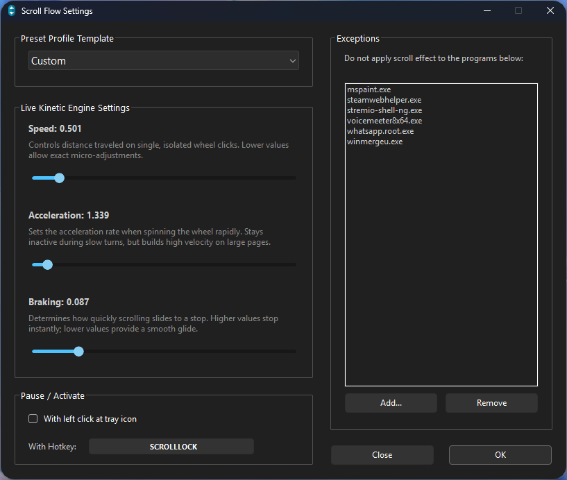
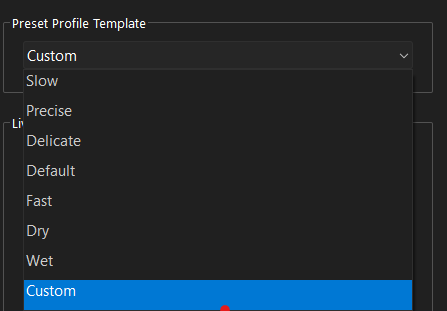

# Scroll-Flow  

Scroll Flow is a lightweight utility that enhances mouse scrolling with smoother movement, improved responsiveness, and refined acceleration behavior for a more natural navigation experience.  
  

Pre-defined presets and a custom one:  

---

**Built with ❤️ by** **[Melo](https://github.com/Melo-Professional)**  
*Feedback? Open an issue or star the repo!*
