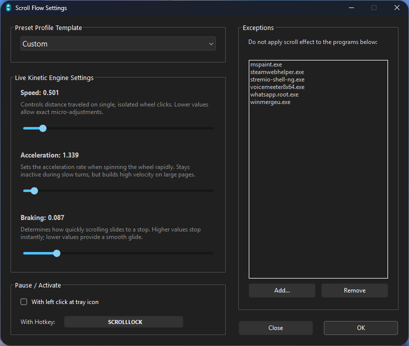
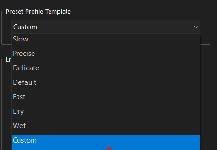

<h1 align="center">Scroll Flow</h1>

  
    

Natural Scroll for your mouse

---
Scroll Flow is a lightweight utility that enhances mouse scrolling with smoother movement, improved responsiveness, and refined acceleration behavior for a more natural navigation experience.

[https://github.com/user-attachments/assets/4ddf1c14-6362-417c-94b1-99c2a172c7bb](https://github.com/user-attachments/assets/4ddf1c14-6362-417c-94b1-99c2a172c7bb)

Pre-defined presets and a custom one:  

---

**Built with ❤️ by** **[Melo](https://github.com/Melo-Professional)**  
*Feedback? Open an issue or star the repo!*
